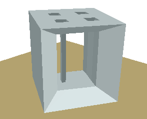
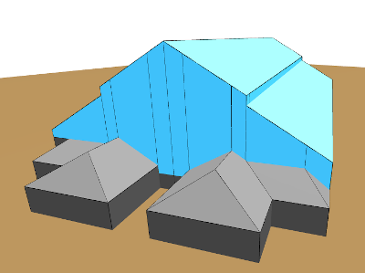
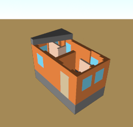

# The .EXT File Format Specification

An .EXT file is a Geographic Information Systems (GIS) format designed to add 3D support to vector data types in an incremental and non-breaking fashion.

## Current Version — 1.0.0
The current version of the .EXT file format is [1.0.0](versions/1.0.0.md).

### Future Versions

1.0.1 — Patches (grammar, spelling, wording) must be submitted against this branch.

1.1.0 — Non breaking changes must be submitted against this branch.

2.0.0 — Breaking changes must be submitted against this branch.

Considered evolutions: (pull requests are welcomed)

- allow other kind of characterization of the vertical space above PLANE objects,
- make the `EXT` objects as re-usable as possible between vectors,
- allow the definition of more than one `EXT` object in an .EXT file with _zones of validity_.

### Previous Versions

Previous specifications are available in the [versions](versions/) folder of this repository.

## Contributing

The specification's sources are the markdown pages and images hosted by this repository.
Submit your feedback and suggestions by, either, commenting existing issues or creating new ones.

Implementations of issues (wording) can be submitted as pull requests.
Please understand that pull requests will be reviewed by Orange and that some implementations may not be appropriate for the specifications.

## Samples

  

[_La Grande Arche_](sample/la_defense/README.md)

  

[_Halles des Vosges_](sample/halles_des_vosges/README.md)

  

[Building blueprints](sample/blueprint/README.md)

## Software Support

Below is a list of known softwares with full .EXT file support:

- CrossWave 520
- MYRIAD Model 520
- Universal Model 530

## Licensing
Copyright Orange 2020

This document is licensed under a Creative Commons Attribution-NonCommercial-NoDerivatives 4.0 International License.

You should have received a copy of the license along with this document.  
If not, see <http://creativecommons.org/licenses/by-nc-nd/4.0/>.
