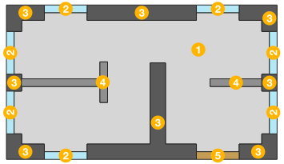
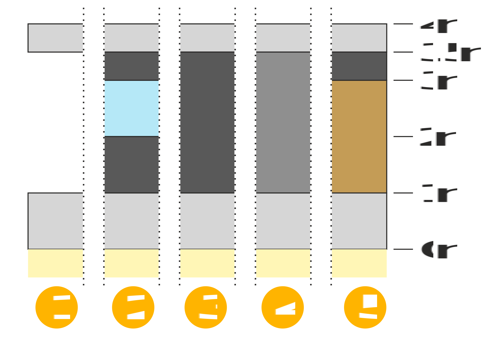

# Modelling blueprints

GIS vectors alone are not suitable to model building’s interior because of the empty room spaces between the floor and ceiling slabs and because of the windows and doors that are embedded into the walls. To a certain extent, .EXT files solve this problem because they let you stack different vector types on top of each other with dedicated thicknesses.

  

*Figure 1 — A small house modelled by EXT-enabled vectors.*

This directory contains the GIS vector files [blueprint.mif](blueprint.mif) and [blueprint.mid](blueprint.mid) that model the house depicted in figure 1. The corresponding .EXT files are :

1. [slab.ext](slab.ext)
2. [window.ext](window.ext)
3. [bearing.ext](bearing.ext)
4. [partition.ext](partition.ext)
5. [door.ext](door.ext)

For example, the file [window.ext](window.ext) describes that vectors with the `Window` type in [blueprint.mif](blueprint.mif) should actually be treated as a stack of four vectors[^scheme] :

- one with the `Slab` type,
- one with the `Bearing` type,
- one with the `Window` type
- and another one with the `Bearing` type.

The figure 2 below details how each of the .EXT files are constructed.

[^scheme]: See scheme number 2 in the figure 2 (right).

 

*Figure 2 — Vectors from [blueprint.mif](blueprint.mif) (left) and their .EXT files assignments (right).*

