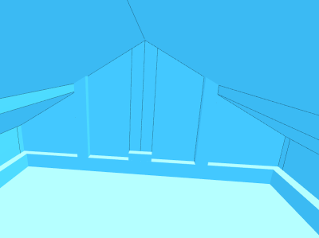

# *Halles des Vosges*, Belfort, France

This sample is a demonstration of multi-material building with a slopped roof. It is composed of both glass and concrete. The main part has two slopes, divided in two parts each. Two smaller buildings are attached in the back, each with slopped roofs too.

## New 3D model

   
*Figure 1 — Enhanced building front (left) and back (right)*

Figure 1 shows the result of the extrusion  of the building. Concrete and glass are respectively in grey and blue. All regions share the same ID, they are joined in the same polygon.

## Before extrusion

   
*Figure 2 — Halles without .ext enhancement*

Without using *.ext* extrusion and basing the 3D model only on GIS vector data and height attributes, *les halles* resembles a cuboid in either glass or concrete and a flat roof, as seen in figure 2.

## Insides

  
*Figure 3 — Inside view of the building*

However, the new building is made of empty volumes (*cf* figure 3). Each regions is one or more volumes. A volume is an empty space encased in a polygon of a certain material. This building has its outside walls differentiated from the inside hence is not an empty box encased in glass and concrete. In order to preserve ground level inside without elevating it, the walls are their own concrete boxes. It is visible in figure 4, the empty insides follow the part of concrete surrounding the building.

## Regions

  
*Figure 4 — Map of regions*

The building has been divided in 28 regions as seen in figure 4 each requiring an *.ext* file to describe the planes of the slopes.

Regions can share the same *.ext* file when sharing the same plane *i.e.* roof. Example : region 20 has its own plane hence its own *.ext*, region 1 shares its *.ext* with 2 other regions since the roofs share the same plane.

Some regions need to be subdivided. Example : region 2 and 3 share the same roof, but don't share inner materials. Region 2 is a concrete pillar while 3 is mainly glass with only a part of concrete.
