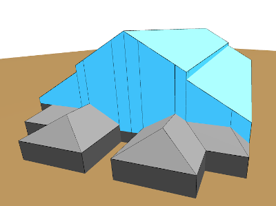

# Halles des Vosges, Belfort, France

This sample is a demonstration of multi-material building and slopped roof.

The construction method is based on the building divided in sectors. These sectors are specified by their angles, and have no fixed amount of sides, in the *.mif* and *.mid* files. The slopes are specified in each *.ext* file. In this case 18 files are sufficient to describe all 28 sectors.

\
*Figure 1 : Sectors*

With the *.ext* file format you can reduce to a certain minimum the number of files you need, because this building specific building has many slopped roof, all different slope needs to have its own description.
\
\
\

\
*Figure 2 : Front of the building*
\
\
\

\
*Figure 3 : Back of the building*
