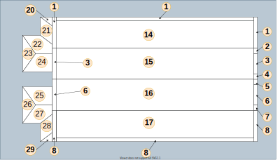
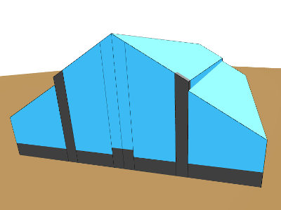

# *Halles des Vosges*, Belfort, France

This sample is a demonstration of multi-material building with a slopped roof. At its base is a concrete wall, followed by glass towards the roof.

The building has been divided in 28 regions as seen in [figure 1]() each requiring an *.ext* file, because of the slopped roof.

Regions can share the same *.ext* file when sharing the same plane *i.e.* roof. Example : region 2 is individual and has its own *.ext*, region 1 shares its *.ext* with 2 other regions.

Some regions need to be subdivided. Example : region 2 and 3 share the same roof, but don't share inner materials. Region 2 is a concrete pillar while 3 is mainly glass with only a part of concrete.

*Figure 1 — Map of regions*

Without using *.ext* extrudation and basing the 3D model only on GIS vector data and height attributes, *les halles* ressembles a cuboid in either glass or concrete and a flat roof, as seen in [figure 2]().

*Figure 2 — Halles without .ext enhancement*

[Figure 3]() shows the result of the extrudation of the building. Concrete is shown in grey, and glass in blue.

 
*Figure 3 — Enhanced building front (left) and back (right)*
