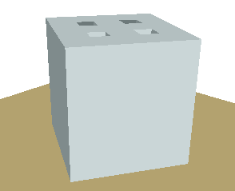
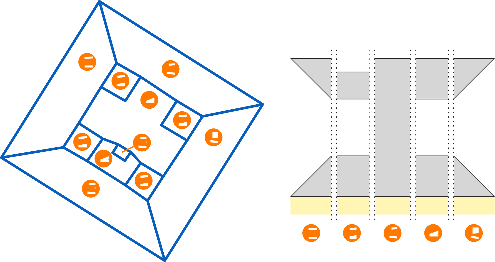

_La Grande Arche_ is an iconic building of the district of _La Défense_ in Paris, France.
It is also the historical motivation for specifying a way to embed 3D models into GIS vector data.  
This directory contains the GIS vector files [la_defense.mif](la_defense.mif) and [la_defense.mid](la_defense.mid) of _La Grande Arche_.
Together, they depict the building as a solid cube (figure 1 left), which height is read from the _height_ attribute in the [mid](la_defense.mid) file.

   
*Figure 1 — Legacy GIS cube model (left) of* La Grande Arche de la Défense *versus the .EXT enhanced model (right).*

However, with the appropriate extrusion instructions (figure 2), the tesseract shape of the building can successfully be rendered (figure 1 right).
The corresponding .EXT files are:

1. [back.ext](back.ext)
2. [middle_square.ext](middle_square.ext)
3. none (based on the _height_ attribute)
4. [middle.ext](middle.ext)
5. [front.ext](front.ext)

  
*Figure 2 — Vectors from [la_defense.mif](la_defense.mif) (left) and their .EXT files assignements (right).*