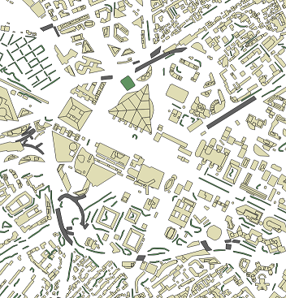
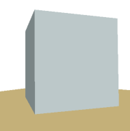
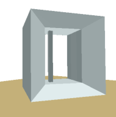
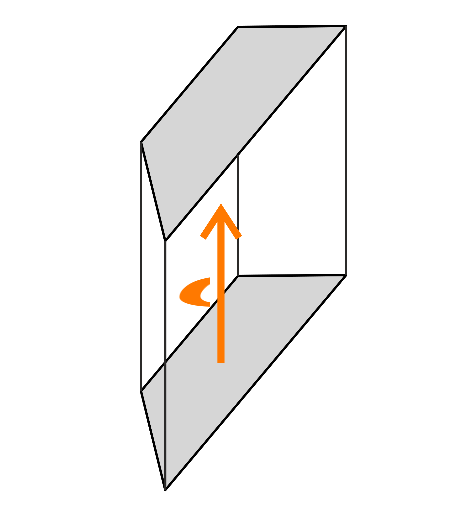
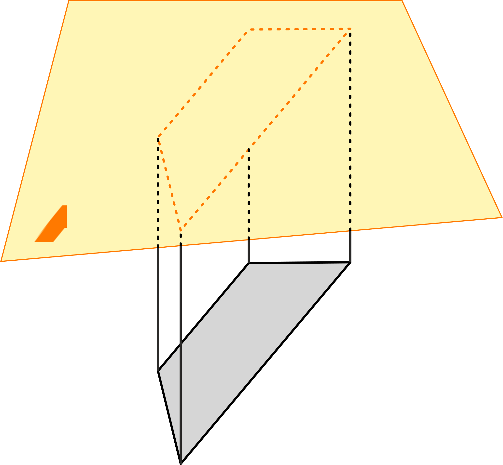
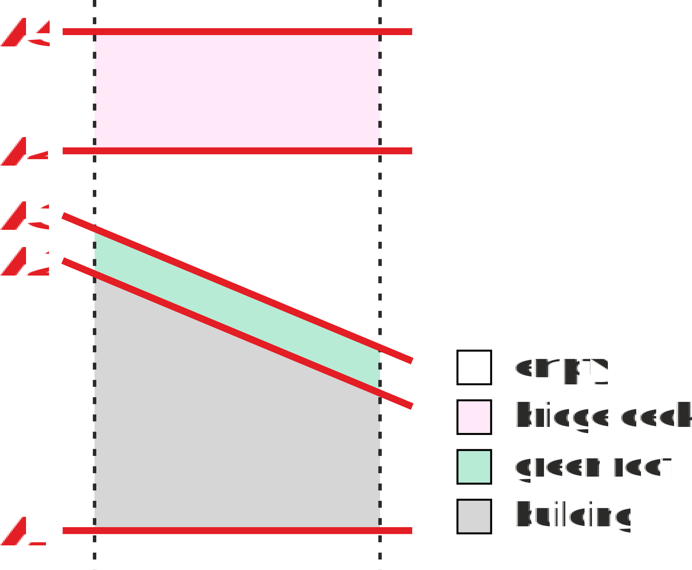

# .EXT File Format Specification

**Version 2.0.0**

Copyright Orange 2020

This document is licensed under a Creative Commons Attribution-NonCommercial-NoDerivatives 4.0 International License.

You should have received a copy of the license along with this document.  
If not, see <http://creativecommons.org/licenses/by-nc-nd/4.0/>.

## Introduction

Vectors are a type of data used by Geographic Information Systems (GIS) to model geographical features (buildings, water surfaces or vegetation areas) as geometrical shapes (points, polylines and polygons) (see figure 1 below).
They can be assigned arbitrary attributes by the mean of a database.
For example, building vectors are usually provided with a height attribute.  
Common vector file formats include: MapInfo TAB, ESRI Shapefile, Geography Markup Language, etc.

  
*Figure 1 — Sample vector data for the district of* La Défense*, Paris, France.*

Vector data, even with height attributes, remain a rough 2.5D approximation of the actual geometrical environment (see figure 2).
More accurate 3D data types exist but are barely adopted by the GIS industry, mainly because they are very expensive and bring very little to surface analyzes.
Yet there exist use cases for which going 3D can make a difference.  
For example, it is the case of mobile coverage maps.
They are the result of a radio wave propagation simulation within a geographical environment built from GIS data.
Thus, they cannot afford to miss architectural features such as the tesseract shape of _La Grande Arche de la Défense_ (Paris, France).

   
*Figure 2 — 2.5D model (left) of* La Grande Arche de la Défense *and a more accurate 3D model (right).*

An .EXT file contains instructions on how to extrude a 2D shape into the third dimension.
A specific vector can be assigned an .EXT file by adding the corresponding path as an attribute.
Thereby, 3D descriptions can incrementally be introduced into GIS vector data without breaking compatibility with the existing GIS softwares.

## Description

Extrusion is the action of giving a z-axis depth to a 2D shape by pushing it over a given distance *d* (figure 3 left).
This process can also be described as pushing the shape along the z-axis until it meets a predefined plane *P*  (figure 3 right).
The latter approach is richer because it allows more complicated 3D shapes to be created by changing the orientation of *P*.
However, this extrusion definition degenerates for planes that cross the 2D shape, thereby constraining valid plane orientations.

   
*Figure 3 — Extrusion of a 2D shape, over a distance* d *(left) or until it meets a plane* P *(right)*

.EXT files describe how 2D shapes must be extruded using the plane definition of extrusion seen above.
To allow even more complicated 3D shapes and/or superpositions of shapes with different attributes, .EXT files actually rely on the definition of an arbitrary number of planes.
Each plane definition comes with a class attribute that describes the vertical space that lies directly above it (see figure 4).

  
*Figure 4 — Side view of a set of planes used to extrude a green-roofed-building built under a bridge.*

The figure 4 demonstrates how multiple planes can be used to control how a 2D shape is extruded:

- *P1* sets where the `building` starts,
- *P2* sets where the `green roof` space starts, implying where the `building`space ends,
- *P3* sets where the `empty` space starts, it is there to separate the `green roof` from the `bridge deck` higher above),
- *P4* sets where the `bridge deck` space starts,
- and *p5* sets where another `empty` space starts, and hence where the `bridge deck` stops.

The names used to describe the vertical spaces (`empty`, `building`, etc.) are arbitrary and must only be meanginful to the software rendering the .EXT file, just like the attributes of a vector file.

## Specification

A .EXT file is a text file with the _.ext_ extention in its name, as in `filename.ext`.
The extension must be lowercase.
The file contains the definition of a [json](https://www.json.org/json-en.html) root object, later referred to as the `EXT` object, with the following attributes (name/value pairs):

- format identification string,
- point declarations,
- plane stack.

All names are case sensitive.

### Format Identification String

The name of the attribute must be `Orange EXT format` and its value is the string `1.0`.
The value is meant to differentiate files that are formatted with different versions of these specifications. 

### Point Declarations

The name of the attribute must be `points` and its value is an array of `POINT` objects.

A `POINT` object has two attributes:

- an integer value named `id` that uniquely identifies the `POINT` object within the `EXT` object,
- an array of three floating point values named `pos` that are the x, y, z coordinate of the `POINT` object. 

The x and y coordinates are supposed to use the same coordinate reference system (CRS) as the host vector file.
The z coordinate is relative to ground altitudes at the location of the vectors that were assigned the .EXT file.

### Plane Stack

The name of the attribute must be `planes` and its value is an array of `PLANE` objects.
There must be at least one `PLANE` object, so enforcing that there should at least be three `POINT` objects declared.

A `PLANE` object has two attributes:

- an array of three `POINT` object ids named `def` that defines the `PLANE` object,
- an abitrary string named `class` that characterizes the vertical space above the modeled plane.

`PLANE` objects must be well defined (no aligned `POINT` objects) and not vertical.
They must not cross each others within the vertical space directly above and below the vectors that were assigned the `EXT` object.
They must be ordered bottom-up.  
The last two constraints cannot be enforced before the .EXT file is actually applied to a vector.
The file is nonetheless deemed invalid when it happens.